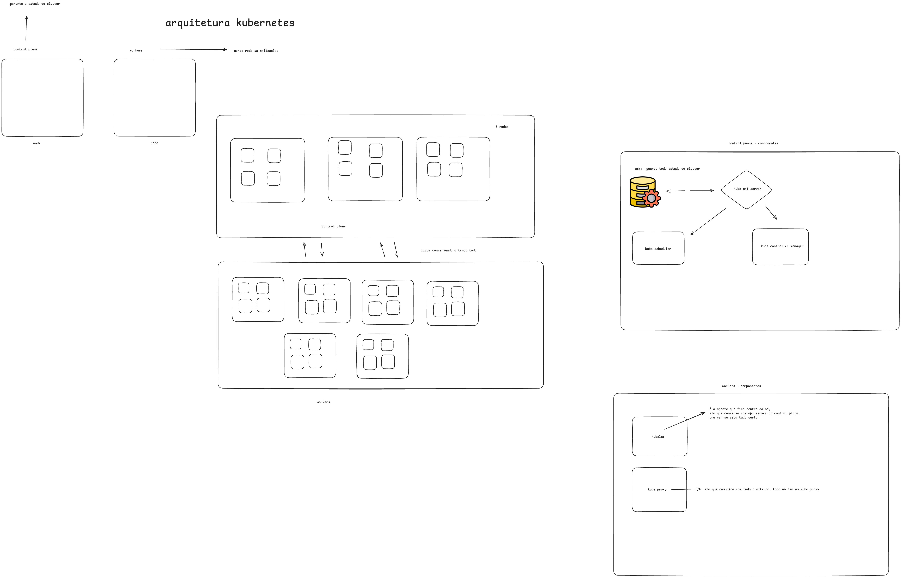

# Kubernetes

### O que é um container?!

- Isolamento de recursos computacional
  - CPU
  - Memoria
  - Usuarios
  - Processos
  - Isolamento de IPs
  - CGroups
  - Namespaces do kernel

### O que é um container engine?!

- é responsável por criar o container (por ele existir mesmo)
- ver se o container esta saúdavel
- pela montagem 
- docker/podman
- não conversa com kernel diretamente, quem conversa é container runtime
- traz uma ida mais de produto
  
### O que é container runtime?!

- quem conversa com o kernel
- baixo e alto nivel 
- container D
- container sandbox
- virtualizados
- RunC
  
### O que é a OCI?!

- fundacão
- RunC de baixo nivel
- Open container Initiative

### O que é Kubernetes?!

- definicão orquestrador de containers
- visão gerencial
- colocar mais de uma replica
- veio do projeto Borg
- desenvolvido em go

### Quais as portas TCP e UDP dos componentes do Kubernetes?!

- kube -> apiserver -> 6334 -> tcp
- etcd -> 2378-2380 -> tcp
- kube-scheduler -> 10251 -> tpc
- kubelet -> 10250 -> tcp
- kube-controller -> 10252 -> tcp
- node-port -> 30000 - 32767 -> tcp
- weave net -> 6783-6784 -> tcp/udp

